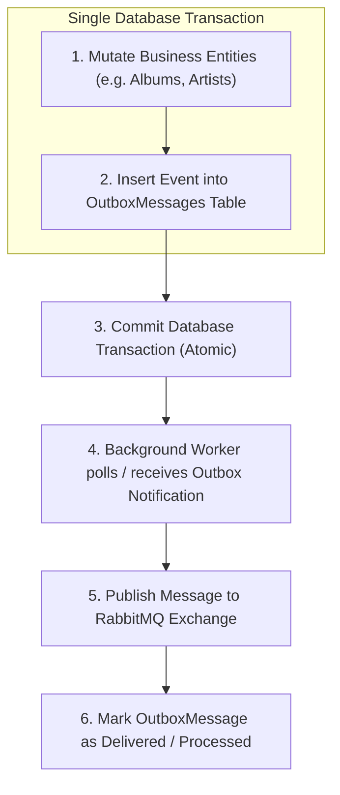
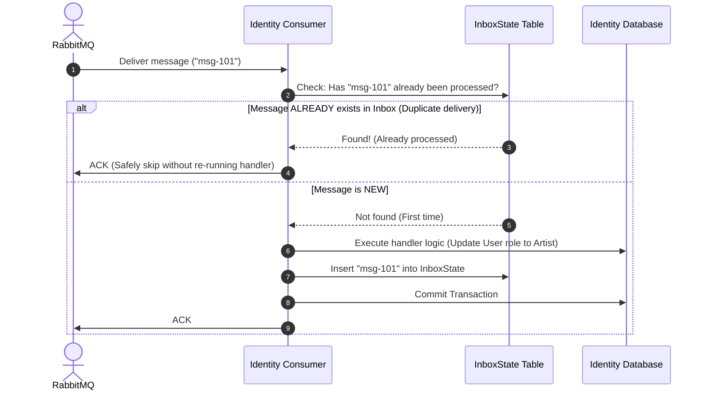
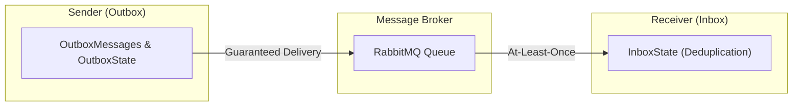

# Architecture Guide: EF Core Interceptors, Shared DbContextBase, Outbox & Inbox Patterns

> **Scope:** Architecture & Messaging Design for SoundWave Modular Monolith  
> **Technologies:** .NET 8, EF Core, MassTransit, RabbitMQ, SQL Server

---

## 1. EF Core Interceptors

### What is an EF Core Interceptor?
An **EF Core Interceptor** is middleware that hooks directly into EF Core's execution pipeline before or after database commands execute (such as `SaveChangesAsync`).

```mermaid
flowchart LR
    Handler["Command Handler"] -->|1. await dbContext.SaveChangesAsync()| Interceptor["EF Core SaveChangesInterceptor"]
    Interceptor -->|2. Automatically inject CreatedBy/Audit & Outbox entries| ChangeTracker["DbContext ChangeTracker"]
    ChangeTracker -->|3. Single Atomic SQL Commit| DB[("SQL Server")]
```

### Why use an Interceptor?
1. **Single Responsibility & Clean DbContext:** Moves cross-cutting concerns (audit timestamps, user IDs, domain event harvesting) out of the `DbContext` class into dedicated, single-purpose classes.
2. **Translating Domain Events to Outbox Messages:** When an entity raises an in-memory domain event (e.g. `artist.Approve()`), the interceptor intercepts `SaveChangesAsync`, extracts the domain events from all tracked entities, serializes them into `OutboxMessage` rows, and adds them to the change tracker *before* the SQL transaction commits.

### Example: Auditing Interceptor in C#

```csharp
using Microsoft.EntityFrameworkCore;
using Microsoft.EntityFrameworkCore.Diagnostics;
using SoundWave.SharedKernel.Entities;
using SoundWave.SharedKernel.Interfaces;

namespace SoundWave.SharedKernel.Data.Interceptors;

public class AuditableEntityInterceptor : SaveChangesInterceptor
{
    private readonly ICurrentUserService _currentUserService;

    public AuditableEntityInterceptor(ICurrentUserService currentUserService)
    {
        _currentUserService = currentUserService;
    }

    public override ValueTask<InterceptionResult<int>> SavingChangesAsync(
        DbContextEventData eventData,
        InterceptionResult<int> result,
        CancellationToken cancellationToken = default)
    {
        if (eventData.Context is null) return base.SavingChangesAsync(eventData, result, cancellationToken);

        var currentUserId = _currentUserService.UserId;
        var now = DateTime.UtcNow;

        foreach (var entry in eventData.Context.ChangeTracker.Entries<BaseEntity>())
        {
            if (entry.State == EntityState.Added)
            {
                entry.Entity.CreatedBy = currentUserId;
                entry.Entity.CreatedDate = now;
            }
            else if (entry.State == EntityState.Modified)
            {
                entry.Entity.UpdatedBy = currentUserId;
                entry.Entity.UpdatedDate = now;
            }
        }

        return base.SavingChangesAsync(eventData, result, cancellationToken);
    }
}
```

---

## 2. Shared `SoundWaveDbContextBase<TContext>`

Currently, `IdentityDbContext`, `CatalogDbContext`, and `AppDbContext` repeat change-tracking audit logic and MassTransit entity mappings. A shared base context in `SoundWave.SharedKernel` provides a DRY foundation.

### Generic Base Context Pattern

```csharp
using Microsoft.EntityFrameworkCore;
using SoundWave.SharedKernel.Entities;
using SoundWave.SharedKernel.Interfaces;

namespace SoundWave.SharedKernel.Data;

public abstract class SoundWaveDbContextBase<TContext> : DbContext 
    where TContext : DbContext
{
    private readonly ICurrentUserService _currentUserService;

    protected SoundWaveDbContextBase(
        DbContextOptions<TContext> options, 
        ICurrentUserService currentUserService) : base(options)
    {
        _currentUserService = currentUserService;
    }

    protected override void OnModelCreating(ModelBuilder modelBuilder)
    {
        base.OnModelCreating(modelBuilder);
        
        // Auto-configure MassTransit Outbox and Inbox tables for this context
        modelBuilder.AddMassTransitOutboxEntities();
    }

    public override Task<int> SaveChangesAsync(CancellationToken cancellationToken = default)
    {
        var currentUserId = _currentUserService.UserId;
        var now = DateTime.UtcNow;

        foreach (var entry in ChangeTracker.Entries<BaseEntity>())
        {
            if (entry.State == EntityState.Added)
            {
                entry.Entity.CreatedBy = currentUserId;
                entry.Entity.CreatedDate = now;
            }
            else if (entry.State == EntityState.Modified)
            {
                entry.Entity.UpdatedBy = currentUserId;
                entry.Entity.UpdatedDate = now;
            }
        }

        return base.SaveChangesAsync(cancellationToken);
    }
}
```

---

## 3. The Outbox Pattern (Sender Side)

### The Dual-Write Problem
When saving state to the database AND publishing a message to RabbitMQ in a single business flow:
- If the DB save succeeds but RabbitMQ is unreachable $\to$ **Message lost!**
- If the message is published but the DB transaction rolls back $\to$ **Ghost message processed!**

### How Outbox Solves It
The message is saved to an `OutboxMessages` table in the **same database transaction** as the business data. A background service reads the table and publishes to RabbitMQ reliably.



---

## 4. The Inbox Pattern (Receiver Side & Idempotency)

### Why is an Inbox Needed?
Message brokers (RabbitMQ, Azure Service Bus, Kafka) guarantee **At-Least-Once Delivery**, NOT Exactly-Once Delivery.

#### Failure Scenario without an Inbox:
1. **Catalog Module** publishes `ArtistApprovedEvent` (`MessageId = 101`).
2. **RabbitMQ** delivers `MessageId = 101` to **Identity Module**.
3. **Identity Consumer** executes logic:
   - Changes user role to `Artist`.
   - Queues welcome email.
   - Saves to DB.
4. **Network Drop!** Before the consumer can send the `ACK` (acknowledgment) back to RabbitMQ, the connection drops.
5. RabbitMQ assumes the consumer crashed and redelivers `MessageId = 101`.
6. **Bug:** The consumer runs a second time, sending duplicate emails and repeating side-effects!

### How the Inbox Pattern Works (Deduplication)



---

## 5. Architectural Comparison: MassTransit vs Custom Outbox/Inbox



| Feature / Challenge | MassTransit Transactional Outbox | Custom Built Outbox |
| :--- | :--- | :--- |
| **Transaction Enlistment** | **Automatic**: Hooked into EF Core execution pipeline via `IPublishEndpoint`. | **Manual**: Must write to `OutboxMessages` DbSet before `SaveChangesAsync()`. |
| **Multi-Instance Locking** | **Built-in**: Uses `OutboxState` row locks so multiple API pods/replicas don't double-publish. | **Complex**: Must implement SQL Server `WITH (UPDLOCK, READPAST)` or Redis RedLock. |
| **Latency** | **Near Real-time**: Dispatches immediately via in-memory notification when the transaction commits. | **Polling delay**: Polling loop (e.g. every 2-5 seconds via `BackgroundService`). |
| **Inbox & Idempotency** | **Built-in**: `InboxState` prevents duplicate processing when network retries occur. | **Manual**: You must create your own inbox tracking table and consumer filters. |
| **Dead-lettering & Retries** | **Built-in**: Exponential backoff, error queues (`_error`), dead-letter exchange. | **Manual**: Must write custom retry counts, poison message handling, and recovery loops. |
| **Maintenance Cost** | **Zero**: Maintained and battle-tested by MassTransit team. | **High**: High risk of race conditions, deadlocks, and missed edge cases. |

---

## 6. Key Takeaways & Recommendations

1. **Shared DbContextBase:** Highly recommended. Eliminates duplicate code across module contexts (`Identity`, `Catalog`, `Playlist`, etc.).
2. **EF Core Interceptors:** Clean way to extract auditing and event dispatching logic without cluttering the DbContext.
3. **MassTransit Outbox + Inbox:** Provides end-to-end reliability (Outbox for sending, Inbox for receiving) with zero manual distributed locking or deduplication code.
