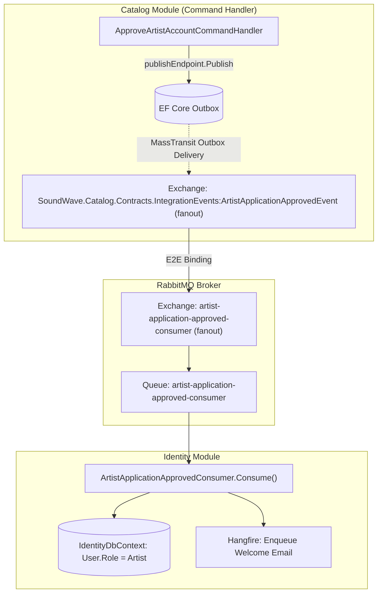
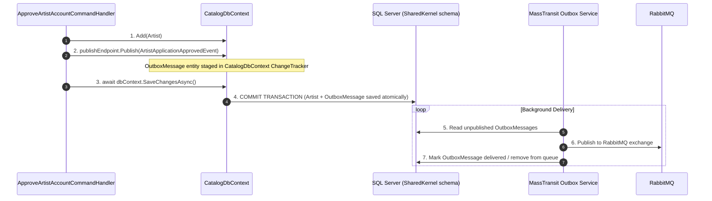

# MassTransit & RabbitMQ Architecture Guide — SoundWave

This guide documents the messaging topology, patterns, and design decisions in **SoundWave** using **MassTransit** and **RabbitMQ**.

---

## 1. Architectural Evolution

| Capability | Raw RabbitMQ (Legacy) | MassTransit (Current) |
|---|---|---|
| **Topology Declaration** | Hand-declared exchanges, queues, bindings, and DLXs per worker | Auto-declared by MassTransit from C# consumer types |
| **Routing** | String routing keys with manual dispatchers (`switch`/dictionaries) | Type-safe CLR type routing via fanout exchanges |
| **Transactional Outbox** | Custom `OutboxMessages` table + manual background polling worker | Built-in `MassTransit.EntityFrameworkCore` transactional outbox |
| **Consumer Lifecycle** | Custom `BackgroundService` with manual loop, channel pooling & QoS | Hosted bus with auto-managed concurrency, scopes & retries |
| **Error Handling** | Manual DLX/DLQ queue configuration | Built-in exponential backoff retry + automatic `_error` queues |
| **Deduplication** | None (at-least-once with manual idempotency) | Built-in `InboxState` consumer deduplication |

---

## 2. Type-Based Topology & Exchange-to-Exchange (E2E) Routing

MassTransit uses **C# Types as the routing system**. Every integration event record defines its own fanout exchange in RabbitMQ.



### Why 2 Exchanges per Consumer? (E2E Binding)
1. **Message Exchange (`ArtistApplicationApprovedEvent`):** Represents *what happened*. Any number of independent microservices/modules can bind to it.
2. **Consumer Exchange (`artist-application-approved-consumer`):** Represents the *inbox* for that consumer. Multiple event types can be funneled into one consumer inbox without changing publisher code.

---

## 3. MassTransit Transactional Outbox Flow

When a command handler publishes an event, MassTransit intercepts the call and writes an `OutboxMessage` entity into the same `CatalogDbContext` transaction.



### Outbox Tables in SQL Server
All MassTransit outbox/inbox tables are scoped cleanly to the `SharedKernel` schema:
* `[SharedKernel].[OutboxMessages]` — pending messages awaiting delivery to RabbitMQ.
* `[SharedKernel].[OutboxState]` — outbox delivery coordination and locking.
* `[SharedKernel].[InboxState]` — consumer idempotency and message deduplication.

---

## 4. Modular Consumer Registration

Each module encapsulates its own consumers and outbox configuration:

```csharp
// Program.cs — Composition Root
builder.Services.AddMassTransitBus(builder.Configuration, x =>
{
    // Module Outbox configuration
    CatalogModule.ConfigureMassTransitOutbox(x);

    // Module Consumer registrations
    IdentityModule.RegisterConsumers(x);
});
```

### Inside `IdentityModule.cs`:
```csharp
public static void RegisterConsumers(IBusRegistrationConfigurator configurator)
{
    configurator.AddConsumer<ArtistApplicationApprovedConsumer>();
    configurator.AddConsumer<ArtistApplicationRejectedConsumer>();
    configurator.AddConsumer<ArtistApplicationSubmittedConsumer>();
}
```

---

## 5. Resiliency & Fault Tolerance

### Exponential Backoff Retry Policy
Configured globally across all consumers in `SharedKernelExtensions.cs`:
```csharp
cfg.UseMessageRetry(r => r.Exponential(
    retryLimit: 5,
    minInterval: TimeSpan.FromSeconds(1),
    maxInterval: TimeSpan.FromSeconds(30),
    intervalDelta: TimeSpan.FromSeconds(2)
));
```

### Poison Messages & `_error` Queues
If all 5 retry attempts fail:
1. MassTransit captures the complete exception, stack trace, and host headers into the message envelope.
2. The message is automatically moved to the consumer's error queue (e.g. `artist-application-approved-consumer_error`).
3. The main queue continues processing other messages without blocking or CPU thrashing.