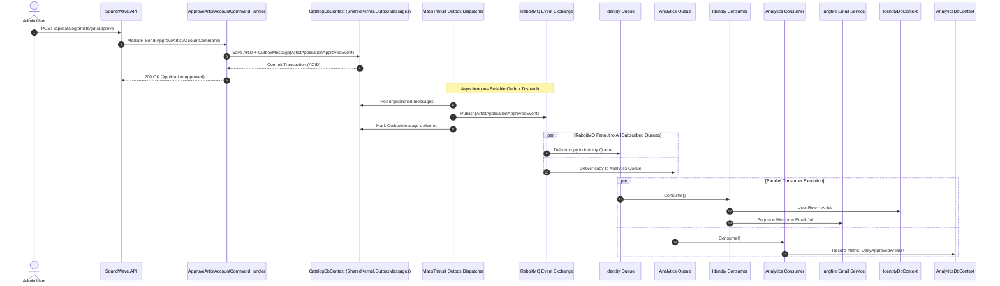

# MassTransit & RabbitMQ Messaging Topology — SoundWave

This document visualizes the complete messaging topology, publish/subscribe fanout architecture, and transactional outbox flow across **SoundWave**. It also details what happens when a new consumer module (e.g., **Analytics**) subscribes to existing events.

---

## 1. Consumer Test Coverage Status

All MassTransit consumers in the solution have 100% automated test coverage in [`tests/SoundWave.Identity.Tests/Messaging/ArtistApplicationConsumerTests.cs`](file:///c:/Users/Ahmad/Projects/SoundWave/tests/SoundWave.Identity.Tests/Messaging/ArtistApplicationConsumerTests.cs):

| Consumer Class | Handled Event | Tested Scenarios | Test Status |
| :--- | :--- | :--- | :--- |
| [`ArtistApplicationApprovedConsumer`](file:///c:/Users/Ahmad/Projects/SoundWave/src/Modules/SoundWave.Identity/Messaging/Consumers/ArtistApplicationApprovedConsumer.cs) | `ArtistApplicationApprovedEvent` | 1. User exists: Role upgraded to `Artist` + Welcome Email enqueued to Hangfire.<br>2. User not found: Logs warning, skips role update & email. | **PASS (2/2)** |
| [`ArtistApplicationSubmittedConsumer`](file:///c:/Users/Ahmad/Projects/SoundWave/src/Modules/SoundWave.Identity/Messaging/Consumers/ArtistApplicationSubmittedConsumer.cs) | `ArtistApplicationSubmittedEvent` | 1. User exists: Acknowledgement Email enqueued to Hangfire.<br>2. User not found: Logs warning, skips email. | **PASS (2/2)** |
| [`ArtistApplicationRejectedConsumer`](file:///c:/Users/Ahmad/Projects/SoundWave/src/Modules/SoundWave.Identity/Messaging/Consumers/ArtistApplicationRejectedConsumer.cs) | `ArtistApplicationRejectedEvent` | 1. User exists: Rejection Email with admin review reason enqueued.<br>2. User not found: Logs warning, skips email. | **PASS (2/2)** |

*Total test suite: **88/88 passed** (Catalog: 34, Identity: 50, Streaming: 1, Playlist: 1, Social: 1, Analytics: 1).*

---

## 2. Current Resulting Topology (Mermaid Chart)

MassTransit automatically configures a **Type-Based Exchange-to-Exchange (E2E)** fanout topology in RabbitMQ based on CLR types and consumer interfaces.

```mermaid
flowchart TD
    classDef publisher fill:#1e3a8a,stroke:#3b82f6,stroke-width:2px,color:#ffffff;
    classDef eventExchange fill:#4338ca,stroke:#6366f1,stroke-width:2px,color:#ffffff;
    classDef consumerExchange fill:#065f46,stroke:#10b981,stroke-width:2px,color:#ffffff;
    classDef queue fill:#047857,stroke:#34d399,stroke-width:2px,color:#ffffff;
    classDef handler fill:#7c2d12,stroke:#f97316,stroke-width:2px,color:#ffffff;
    classDef storage fill:#1f2937,stroke:#6b7280,stroke-width:2px,color:#ffffff;
    classDef errorQueue fill:#7f1d1d,stroke:#ef4444,stroke-width:2px,color:#ffffff;

    subgraph CatalogPublisher ["Catalog Module (Publisher)"]
        CmdApprove["ApproveArtistAccountCommandHandler"]:::publisher
        CmdApply["ApplyForArtistAccountCommandHandler"]:::publisher
        CmdReject["RejectArtistAccountCommandHandler"]:::publisher
        
        CatalogDB[("CatalogDbContext\n(Catalog Schema)")]:::storage
        OutboxTable[("SharedKernel.OutboxMessages\n(Transactional Outbox)")]:::storage
        OutboxWorker["MassTransit Outbox Worker\n(Scoped Publisher)"]:::publisher
        
        CmdApprove -->|1. Mutate Entity + Publish| CatalogDB
        CmdApply -->|1. Mutate Entity + Publish| CatalogDB
        CmdReject -->|1. Mutate Entity + Publish| CatalogDB
        CatalogDB --- OutboxTable
        OutboxTable -->|2. Background Polling Sweep| OutboxWorker
    end

    subgraph RabbitMQBroker ["RabbitMQ Broker (Topology)"]
        OutboxWorker -->|3. Publish| ExApproved
        OutboxWorker -->|3. Publish| ExSubmitted
        OutboxWorker -->|3. Publish| ExRejected

        %% Event Type Fanout Exchanges
        ExApproved["Exchange (fanout):\nSoundWave.Catalog.Contracts.IntegrationEvents:\nArtistApplicationApprovedEvent"]:::eventExchange
        ExSubmitted["Exchange (fanout):\nSoundWave.Catalog.Contracts.IntegrationEvents:\nArtistApplicationSubmittedEvent"]:::eventExchange
        ExRejected["Exchange (fanout):\nSoundWave.Catalog.Contracts.IntegrationEvents:\nArtistApplicationRejectedEvent"]:::eventExchange

        %% Consumer Fanout Exchanges (E2E Binding)
        ExConsumerApproved["Exchange (fanout):\nartist-application-approved"]:::consumerExchange
        ExConsumerSubmitted["Exchange (fanout):\nartist-application-submitted"]:::consumerExchange
        ExConsumerRejected["Exchange (fanout):\nartist-application-rejected"]:::consumerExchange

        %% Queues
        QApproved["Queue:\nartist-application-approved"]:::queue
        QSubmitted["Queue:\nartist-application-submitted"]:::queue
        QRejected["Queue:\nartist-application-rejected"]:::queue

        %% Error Queues
        ErrApproved["Queue:\nartist-application-approved_error"]:::errorQueue
        ErrSubmitted["Queue:\nartist-application-submitted_error"]:::errorQueue
        ErrRejected["Queue:\nartist-application-rejected_error"]:::errorQueue

        ExApproved -->|E2E Binding| ExConsumerApproved -->|E2Q Binding| QApproved
        ExSubmitted -->|E2E Binding| ExConsumerSubmitted -->|E2Q Binding| QSubmitted
        ExRejected -->|E2E Binding| ExConsumerRejected -->|E2Q Binding| QRejected

        QApproved -.->|Max Retries Exceeded| ErrApproved
        QSubmitted -.->|Max Retries Exceeded| ErrSubmitted
        QRejected -.->|Max Retries Exceeded| ErrRejected
    end

    subgraph IdentitySubscriber ["Identity Module (Consumer)"]
        QApproved -->|4. Push Message| ConsumerApproved["ArtistApplicationApprovedConsumer"]:::handler
        QSubmitted -->|4. Push Message| ConsumerSubmitted["ArtistApplicationSubmittedConsumer"]:::handler
        QRejected -->|4. Push Message| ConsumerRejected["ArtistApplicationRejectedConsumer"]:::handler

        IdentityDB[("IdentityDbContext\n(Identity Schema)")]:::storage
        HangfireJob["Hangfire: ISendEmailJob\n(Email Background Queue)")]:::handler
        InboxTable[("SharedKernel.InboxState\n(Deduplication)")]:::storage

        ConsumerApproved -->|5. Validate & Idempotency| InboxTable
        ConsumerApproved -->|6. Update Role = Artist| IdentityDB
        ConsumerApproved -->|7. Enqueue Email| HangfireJob

        ConsumerSubmitted -->|5. Validate & Idempotency| InboxTable
        ConsumerSubmitted -->|6. Enqueue Email| HangfireJob

        ConsumerRejected -->|5. Validate & Idempotency| InboxTable
        ConsumerRejected -->|6. Enqueue Email with Reason| HangfireJob
    end
```

---

## 3. Adding a New Consumer (e.g., `AnalyticsModule`)

### What Happens Architecturally?

When the **Analytics** module wants to track artist approval metrics or listen to `ArtistApplicationApprovedEvent`, **zero changes are made to the publisher (`CatalogModule`)**.

```mermaid
flowchart TD
    classDef eventExchange fill:#4338ca,stroke:#6366f1,stroke-width:2px,color:#ffffff;
    classDef identityExchange fill:#065f46,stroke:#10b981,stroke-width:2px,color:#ffffff;
    classDef analyticsExchange fill:#9333ea,stroke:#c084fc,stroke-width:2px,color:#ffffff;
    classDef identityQueue fill:#047857,stroke:#34d399,stroke-width:2px,color:#ffffff;
    classDef analyticsQueue fill:#7e22ce,stroke:#e879f9,stroke-width:2px,color:#ffffff;
    classDef identityConsumer fill:#0f766e,stroke:#14b8a6,stroke-width:2px,color:#ffffff;
    classDef analyticsConsumer fill:#6b21a8,stroke:#a855f7,stroke-width:2px,color:#ffffff;
    classDef publisher fill:#1e3a8a,stroke:#3b82f6,stroke-width:2px,color:#ffffff;

    Publisher["Catalog Command Handler\n(Publishes 1 Event)"]:::publisher
    
    ExEvent["Exchange (fanout):\n...ArtistApplicationApprovedEvent"]:::eventExchange

    Publisher -->|Publish 1 Message| ExEvent

    subgraph IdentityBranch ["Identity Module Branch"]
        ExIdentity["Exchange (fanout):\nartist-application-approved"]:::identityExchange
        QIdentity["Queue:\nartist-application-approved"]:::identityQueue
        ConsumerIdentity["ArtistApplicationApprovedConsumer\n(Upgrades Role + Emails User)"]:::identityConsumer

        ExEvent -->|E2E Fanout| ExIdentity --> QIdentity --> ConsumerIdentity
    end

    subgraph AnalyticsBranch ["NEW: Analytics Module Branch"]
        ExAnalytics["Exchange (fanout):\nartist-application-approved-analytics"]:::analyticsExchange
        QAnalytics["Queue:\nartist-application-approved-analytics"]:::analyticsQueue
        ConsumerAnalytics["ArtistApplicationApprovedAnalyticsConsumer\n(Increments Real-time Metrics & KPIs)"]:::analyticsConsumer

        ExEvent -->|E2E Fanout (Auto-Created)| ExAnalytics --> QAnalytics --> ConsumerAnalytics
    end
```

---

### Step-by-Step Breakdown of What Happens Under the Hood:

1. **Zero Impact on Catalog**:
   - `ApproveArtistAccountCommandHandler` continues to publish `ArtistApplicationApprovedEvent` via `publishEndpoint.Publish(...)`.
   - The publisher has no awareness of who is listening.
2. **RabbitMQ Topic Fanout Duplication**:
   - When the event hits the `ArtistApplicationApprovedEvent` exchange, RabbitMQ automatically duplicates the message payload and places a copy into **both**:
     - `artist-application-approved` (consumed by Identity)
     - `artist-application-approved-analytics` (consumed by Analytics)
3. **Total Isolation of Failures & Retries**:
   - If the `Analytics` database is temporarily slow, down, or throws an exception, it will retry according to the configured exponential retry policy (`RabbitMqConfig.Retry`) and route to `artist-application-approved-analytics_error`.
   - **The `Identity` consumer is completely unaffected**: User role upgrade and email sending proceed with zero delay.
4. **Independent Idempotency (`SharedKernel.InboxState`)**:
   - Each consumer records its own message consumption status in `InboxState` indexed by `(MessageId, ConsumerId)`.
5. **How to Register the Analytics Consumer in Code**:

```csharp
// 1. In SoundWave.Analytics/Messaging/Consumers/ArtistApplicationApprovedAnalyticsConsumer.cs:
public sealed class ArtistApplicationApprovedAnalyticsConsumer(
    AnalyticsDbContext db,
    ILogger<ArtistApplicationApprovedAnalyticsConsumer> logger)
    : IConsumer<ArtistApplicationApprovedEvent>
{
    public async Task Consume(ConsumeContext<ArtistApplicationApprovedEvent> context)
    {
        var data = context.Message;
        // Record KPI metric, increment daily approved artist count, etc.
        await db.ArtistMetrics.AddAsync(new ArtistMetric { ArtistId = data.ArtistId, ApprovedAt = DateTime.UtcNow });
        await db.SaveChangesAsync(context.CancellationToken);
    }
}

// 2. In SoundWave.Analytics/AnalyticsModule.cs:
public static void RegisterConsumers(IBusRegistrationConfigurator configurator)
{
    configurator.AddConsumer<ArtistApplicationApprovedAnalyticsConsumer>();
}

// 3. In SoundWave.API/Program.cs:
builder.Services.AddMassTransitBus(builder.Configuration, x =>
{
    CatalogModule.ConfigureMassTransitOutbox(x);
    IdentityModule.RegisterConsumers(x);
    AnalyticsModule.RegisterConsumers(x); // Automatically declares exchanges, queues, and E2E bindings
});
```

---

## 4. End-to-End Sequence Diagram (Multi-Consumer Execution)


