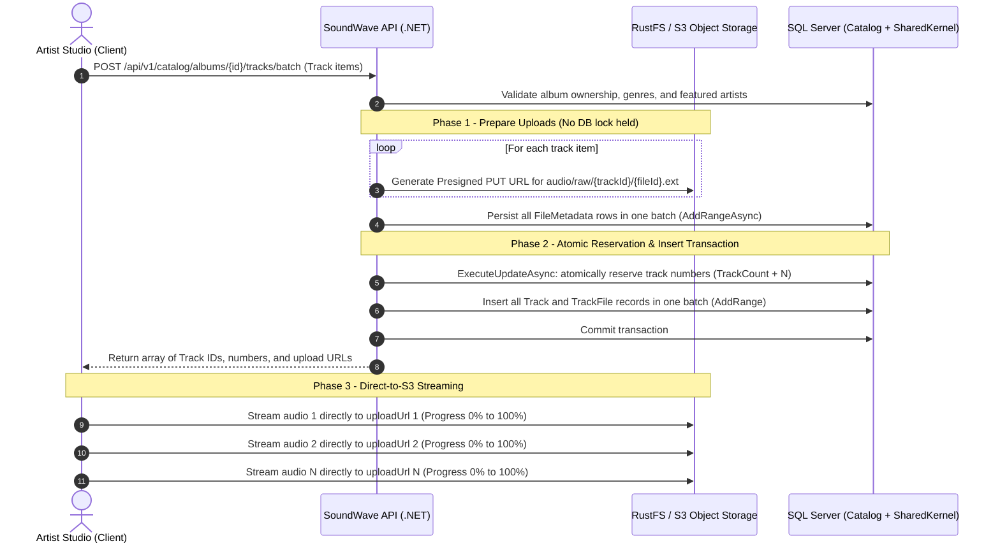

# Batch Track Upload Flow

```mermaid
sequenceDiagram
    autonumber
    actor Artist as Artist Studio (Client)
    participant API as SoundWave API (.NET)
    participant S3 as RustFS / S3 Object Storage
    participant DB as SQL Server (Catalog + SharedKernel)

    Artist->>API: POST /api/v1/catalog/albums/{id}/tracks/batch (Track items)
    API->>DB: Validate album ownership, genres, and featured artists

    Note over API,S3: Phase 1 - Prepare Uploads (No DB lock held)
    loop For each track item
        API->>S3: Generate Presigned PUT URL for audio/raw/{trackId}/{fileId}.ext
    end
    API->>DB: Persist all FileMetadata rows in one batch (AddRangeAsync)

    Note over API,DB: Phase 2 - Atomic Reservation & Insert Transaction
    API->>DB: ExecuteUpdateAsync: atomically reserve track numbers (TrackCount + N)
    API->>DB: Insert all Track and TrackFile records in one batch (AddRange)
    API->>DB: Commit transaction
    API-->>Artist: Return array of Track IDs, numbers, and upload URLs

    Note over Artist,S3: Phase 3 - Direct-to-S3 Streaming
    Artist->>S3: Stream audio 1 directly to uploadUrl 1 (Progress 0% to 100%)
    Artist->>S3: Stream audio 2 directly to uploadUrl 2 (Progress 0% to 100%)
    Artist->>S3: Stream audio N directly to uploadUrl N (Progress 0% to 100%)
```
