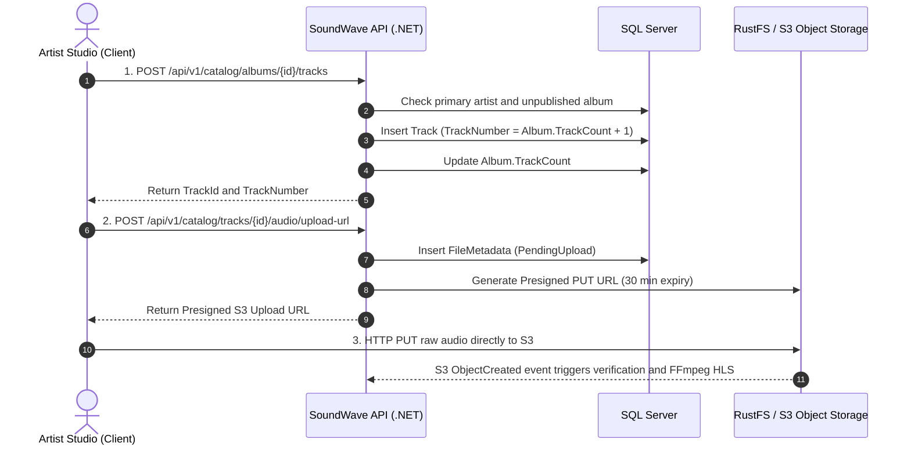

# Single Track Upload Flow

```mermaid
sequenceDiagram
    autonumber
    actor Artist as Artist Studio (Client)
    participant API as SoundWave API (.NET)
    participant DB as SQL Server
    participant S3 as RustFS / S3 Object Storage

    Artist->>API: 1. POST /api/v1/catalog/albums/{id}/tracks
    API->>DB: Check primary artist and unpublished album
    API->>DB: Insert Track (TrackNumber = Album.TrackCount + 1)
    API->>DB: Update Album.TrackCount
    API-->>Artist: Return TrackId and TrackNumber

    Artist->>API: 2. POST /api/v1/catalog/tracks/{id}/audio/upload-url
    API->>DB: Insert FileMetadata (PendingUpload)
    API->>S3: Generate Presigned PUT URL (30 min expiry)
    API-->>Artist: Return Presigned S3 Upload URL

    Artist->>S3: 3. HTTP PUT raw audio directly to S3
    S3-->>API: S3 ObjectCreated event triggers verification and FFmpeg HLS
```
